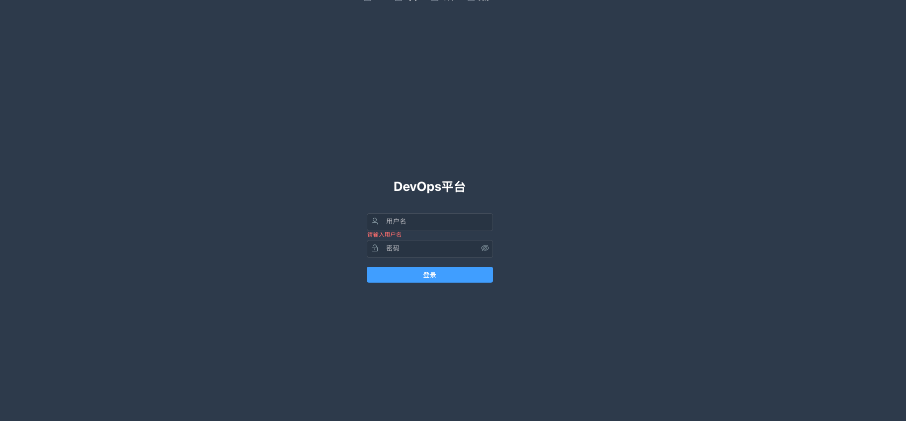
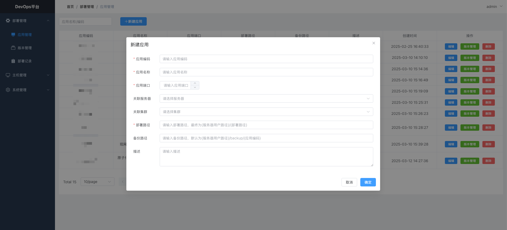
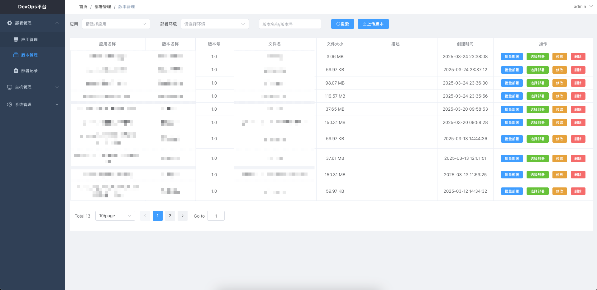
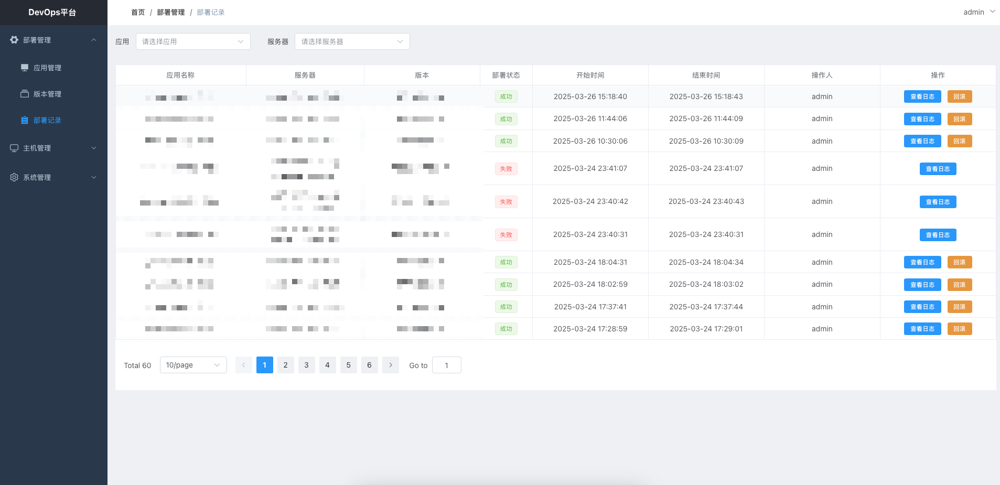
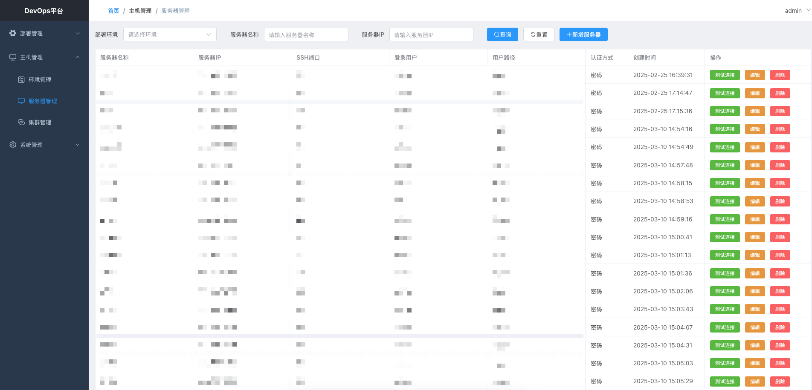

# DevOps 部署平台

## 项目简介

DevOps 部署平台是一个现代化的应用部署管理系统，提供了完整的应用生命周期管理功能，包括应用管理、版本管理、服务器管理、环境管理和部署管理等核心功能。

## 技术栈

### 前端技术栈
- Vue 3
- Vite
- Element Plus
- Pinia
- Vue Router
- Axios

### 后端技术栈
- Spring Boot 2.7.6
- Spring Security
- MyBatis-Plus
- MySQL
- MinIO
- JSch
- JWT

## 功能特性

### 应用管理
- 应用信息管理
- 应用版本管理
- 版本文件上传
- 版本更新记录

### 部署管理
- 多环境部署
- 一键部署
- 部署日志记录
- 部署回滚
- 部署状态监控

### 服务器管理
- 服务器信息管理
- SSH连接测试
- 支持密码/密钥认证
- 服务器分组管理

### 环境管理
- 环境配置管理
- 环境变量管理
- 多环境支持

### 系统管理
- 用户管理
- 角色管理
- 权限控制
- 操作日志

## 快速开始

### 环境要求
- JDK 8+
- Node.js 16+
- MySQL 5.7+
- Redis 6.0+
- MinIO

### 后端部署
1. 创建数据库
```sql
create database deploy_platform default character set utf8mb4 collate utf8mb4_general_ci;
```

2. 修改配置文件
```yaml
# application.yml
spring:
  datasource:
    url: jdbc:mysql://localhost:3306/deploy_platform
    username: your_username
    password: your_password
  
    
minio:
  endpoint: http://localhost:9000
  accessKey: your_access_key
  secretKey: your_secret_key
  bucketName: deploy-versions
```

3. 编译打包
```bash
mvn clean package
```

4. 运行
```bash
java -jar devops.jar
```

### 前端部署
1. 安装依赖
```bash
npm install
```

2. 开发环境运行
```bash
npm run dev
```

3. 生产环境构建
```bash
npm run build
```

4. 打包
```bash
npm run build:zip
```

## 项目结构

### 后端结构
```
backend/
├── src/main/java/com/devops/
│   ├── common/         # 公共组件
│   ├── config/         # 配置类
│   ├── controller/     # 控制器
│   ├── entity/         # 实体类
│   ├── mapper/         # MyBatis接口
│   ├── service/        # 服务接口
│   ├── util/           # 工具类
│   └── vo/             # 视图对象
└── src/main/resources/
    ├── mapper/         # MyBatis映射文件
    └── application.yml # 配置文件
```

### 前端结构
```
frontend/
├── src/
│   ├── api/           # API接口
│   ├── assets/        # 静态资源
│   ├── components/    # 公共组件
│   ├── layout/        # 布局组件
│   ├── router/        # 路由配置
│   ├── store/         # 状态管理
│   ├── utils/         # 工具函数
│   └── views/         # 页面组件
├── public/            # 公共资源
└── vite.config.js     # Vite配置
```

## 开发指南

### 代码规范
- 遵循阿里巴巴Java开发规范
- 使用ESLint进行代码检查
- 使用Prettier进行代码格式化
- 遵循Vue3组件开发规范

### 提交规范
- feat: 新功能
- fix: 修复bug
- docs: 文档更新
- style: 代码格式
- refactor: 重构
- test: 测试
- chore: 构建过程或辅助工具的变动

### 页面展示
- 登录页面

- 应用管理页面

- 版本管理页面

- 部署记录页面

- 服务器管理页面


## 作者

yux 